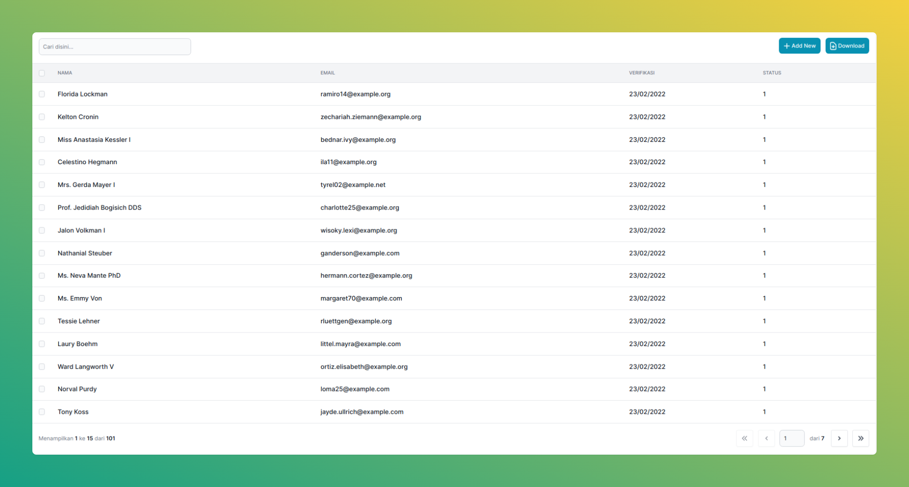

## INERTIA DATATABLE



## RERUITMENT
- php8.1
- inertiajs
- laravel 8 | 9

## INSTALATION
```bash
composer require rizkhal/inertable
```

## USAGE
```bash
php artisan make:inertable UserTable
```

This will be generate a basic inertable starter
```php
<?php

declare(strict_types=1);

namespace App\Inertable;

use Rizkhal\Inertable\Column;
use Rizkhal\Inertable\Inertable;
use Illuminate\Database\Eloquent\Builder;

class UserTable extends Inertable
{
    public function query(): Builder
    {
        // ...
    }

    public function columns(): array
    {
        return [
            // ...
        ];
    }
}
```

## EXAMPLE

### BASIC
```php
<?php

declare(strict_types=1);

namespace App\Inertable;

use App\Models\User;
use Rizkhal\Inertable\Column;
use Illuminate\Support\Carbon;
use Rizkhal\Inertable\Inertable;
use Illuminate\Database\Eloquent\Builder;

class UserTable extends Inertable
{
    public function query(): Builder
    {
        return User::query();
    }

    public function columns(): array
    {
        return [
            Column::blank()->checkbox(),
            Column::make(__('Name'), 'name')->sortable()->searchable(),
            Column::make(__('Email'), 'email')->sortable()->searchable(),
            Column::make(__('Verified'), 'email_verified_at')->sortable()->searchable()->format(fn (Carbon $value): string => $value->format('d/m/Y')),
            Column::make(__('status'), 'status')->sortable()->searchable(),
            Column::blank(),
        ];
    }
}
```

### ADVANCE
...


